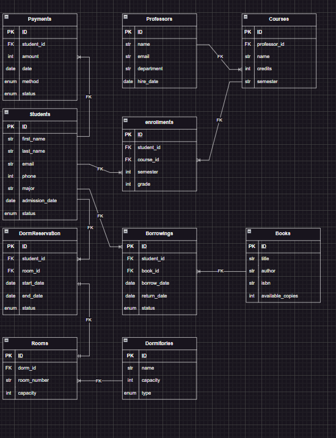

# MySQL University Project

This project contains a complete set of exercises and database structures for learning and practicing **MySQL**.  
The goal is to cover both theory and hands-on SQL practice.

---

## Project Structure

### 1. `tables.py`
- Contains **queries for creating all database tables**.
- Includes main tables such as:
  - `students`
  - `dormitories`
  - `rooms`
  - `professors`
  - `dormreservation`
  - and other supporting tables.
- All relationships (**1:1, 1:N, N:M**) are defined here.

### 2. `insert_values.py`
- Contains **INSERT queries** for populating the tables with sample data.
- Example:
  ```sql
  INSERT INTO dormreservation(student_id, room_id, status)
  VALUES (1,1,'active'), (2,2,'expired'), (3,3,'cancelled');
  ```

### 3. `exercises.py`
- Contains **60 SQL exercises** divided into three levels:
  - **20 Beginner level** → SELECT, INSERT, UPDATE, DELETE, WHERE, ORDER BY, etc.
  - **20 Intermediate level** → JOINs, GROUP BY, HAVING, Subqueries, etc.
  - **20 Advanced level** → CTE, Recursive CTE, Window Functions, Triggers, Stored Procedures, Indexes, etc.  
- These exercises will help you practice SQL from beginner to advanced.

### 4. `database_design.drawio`
- Contains the **visual ERD (Entity Relationship Diagram)** of the database.
- You can open it with [draw.io](https://app.diagrams.net/) or a VS Code plugin.
- Example placeholder for the database design image:  

    
  *(Replace `database_design.png` with your exported image from draw.io)*

---

## Goal of the Project
- Learn SQL and MySQL step by step (beginner → intermediate → advanced).
- Practice queries on a custom database schema.
- Understand table relationships (1:1, 1:N, N:M).
- Gain experience with advanced concepts like CTE and Stored Procedures.

---

## How to Use
1. Open `tables.py`, copy each query, and run it in **MySQL Workbench** (or any MySQL client) to create all tables.  
2. Open `insert_values.py`, copy the queries, and run them to insert the sample data.  
3. Open `exercises.py`, copy and execute the queries to practice (60 exercises: Beginner, Intermediate, Advanced).  
4. Open `database_design.drawio` or view the exported image (`database_design.png`) to see the ERD (Entity Relationship Diagram).

---

---

## License
This project is created for **learning and practice purposes**.  
You are free to use and share it.
